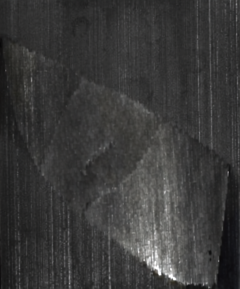
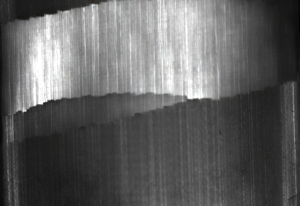

<div align="center">

<pre>
██████╗ ███████╗███████╗███████╗ ██████╗████████╗███████╗       ██████╗ ███████╗███╗   ██╗
██╔══██╗██╔════╝██╔════╝██╔════╝██╔════╝╚══██╔══╝██╔════╝      ██╔════╝ ██╔════╝████╗  ██║
██║  ██║█████╗  █████╗  █████╗  ██║        ██║   ███████╗█████╗██║  ███╗█████╗  ██╔██╗ ██║
██║  ██║██╔══╝  ██╔══╝  ██╔══╝  ██║        ██║   ╚════██║╚════╝██║   ██║██╔══╝  ██║╚██╗██║
██████╔╝███████╗██║     ███████╗╚██████╗   ██║   ███████║      ╚██████╔╝███████╗██║ ╚████║
╚═════╝ ╚══════╝╚═╝     ╚══════╝ ╚═════╝   ╚═╝   ╚══════╝       ╚═════╝ ╚══════╝╚═╝  ╚═══╝
</pre>

<h3>🏭&nbsp; synthetic defect images for AOI — on your own GPU</h3>

<p>
<em>Testing <b>NVIDIA&nbsp;Cosmos</b> for defects generation: a reproducible, single-host
<a href="https://github.com/NVIDIA/OSMO">OSMO</a> deployment on
<a href="https://kind.sigs.k8s.io/">kind</a> that runs the full
<b>defect-image-generation (DIG)</b> pipeline —<br/>
AnomalyGen inference, labeling, and every hard-won fix it took to get there.</em>
</p>

<p>
<a href="https://github.com/NVIDIA/OSMO"></a>
<a href="https://github.com/NVIDIA/skills/tree/main/skills/physical-ai-defect-image-generation"></a>
<a href="https://kind.sigs.k8s.io/"></a>
<a href="https://helm.sh"></a>
<a href="https://min.io"></a>


<a href="LICENSE"></a>
</p>

<code>kind cluster&nbsp;→&nbsp;MinIO S3&nbsp;→&nbsp;OSMO charts&nbsp;→&nbsp;DIG setup (81&nbsp;GB)&nbsp;→&nbsp;AnomalyGen&nbsp;→&nbsp;labeled defect images</code>

</div>

---

## 🎨 The output

Real samples from this deployment's first verified run (metal surface, Day 1 manual-ROI,
pretrained passthrough — 30 labeled images in ~31 min, of which ~8 min was GPU time):

<div align="center">

**clean input → defect mask → generated defect** (`MT_Crack`)

  

**one generated sample per defect class**

| MT_Blowhole | MT_Break | MT_Crack | MT_Fray | MT_Uneven |
|---|---|---|---|---|
|  |  |  |  |  |

</div>

## ✨ What's in the box

|   |   |
|---|---|
| 🏗️&nbsp; **Deploys** | A 6-node **kind** cluster (GPU passthrough, `node_group` scheduling) running the **OSMO** service + backend-operator Helm charts in no-auth dev mode. |
| 🪣&nbsp; **Stores** | A standalone **MinIO** S3 backend on the host's 1 TB volume — survives reboots, handles 80 GB multipart uploads at 60–300 MB/s (the chart's bundled localstack does neither; see [docs/LEARNINGS.md](docs/LEARNINGS.md) §4). |
| 🎨&nbsp; **Generates** | **Cosmos AnomalyGen 2B** defect images via NVIDIA's [DIG skill](https://github.com/NVIDIA/skills/tree/main/skills/physical-ai-defect-image-generation): metal-surface Day 1 verified end-to-end; PCBA / glass ready to go. |
| 🏷️&nbsp; **Labels** | Every generated image ships with masks, crops, annotated overlays, `SDG_result.csv`, and DAFT-v3 labeling artifacts. |
| 🧠&nbsp; **Explains** | [`docs/LEARNINGS.md`](docs/LEARNINGS.md) — the four deployment gotchas (token login, ConfigMap-managed POD_TEMPLATE, task-pod S3 env, MinIO-not-localstack), each *symptom → root cause → fix*. |
| 🔬&nbsp; **Diagnoses** | [`PROGRESS.md`](PROGRESS.md) — the full bring-up forensics: every failure signature (OOM spirals, bucket wipes, token traps, multipart corruption) with root cause and fix. |
| ⏱️&nbsp; **Benchmarks** | [`TIMINGS.md`](TIMINGS.md) — measured wall clocks, phase breakdowns, throughputs, and a localstack-vs-MinIO head-to-head. |

## 🚀 Replicating from scratch

Prerequisites on the host: `docker`, [`kind`](https://kind.sigs.k8s.io/), `kubectl`,
`helm`, the `osmo` CLI, an NVIDIA GPU with drivers + the
[NVIDIA container toolkit](https://docs.nvidia.com/datacenter/cloud-native/container-toolkit/latest/install-guide.html)
(the compute node passes GPUs through via the `nvidia-container-devices` mount in the kind
config), and `/usr/share/nvidia/nvoptix.bin` present on the host (ships with the driver).

```bash
git clone https://github.com/vbhchua/defects-gen && cd defects-gen
cp .env.example .env    # then edit: real HF *user access* token (see .env.example notes)

# 1. Cluster + GPU operator
kind create cluster --config kind-osmo-cluster-config.yaml
helm install gpu-operator nvidia/gpu-operator -n gpu-operator --create-namespace  # wait for nvidia-cuda-validator Completed

# 2. S3 backend (MinIO) + bucket — BEFORE the OSMO charts
kubectl create namespace osmo
kubectl apply -f osmo-values/minio.yaml
kubectl rollout status deploy/minio -n osmo
kubectl run mc-setup --rm -i --restart=Never -n osmo --image=minio/mc --command -- \
  sh -c 'mc alias set m http://minio.osmo.svc.cluster.local:9000 test testtest && mc mb -p m/osmo'

# 3. OSMO service chart (core service, UI, gateway, postgres, redis)
helm repo add osmo https://nvidia.github.io/OSMO/helm-charts && helm repo update
helm upgrade --install osmo osmo/service -n osmo -f osmo-values/service.yaml --wait --timeout 4m

# 4. Backend-operator token secret (see docs/LEARNINGS.md §1), then:
helm upgrade --install osmo-backend-operator osmo/backend-operator \
  -n osmo -f osmo-values/backend-operator.yaml --wait --timeout 3m

# 5. Login + host DNS for the gateway and MinIO
echo "127.0.0.1 quick-start.osmo minio.osmo" | sudo tee -a /etc/hosts
osmo login http://quick-start.osmo --method=dev --username=testuser
kubectl port-forward -n osmo svc/minio 9000:9000 &   # per-session; makes `osmo data` work from the shell

# 6. Credentials for DIG workflows
set -a; . ./.env; set +a
osmo credential set hf-token --type GENERIC --payload token="$HF_TOKEN"
osmo credential set osmo --type DATA --payload endpoint=s3://osmo \
  access_key_id=test access_key=testtest override_url=http://minio.osmo:9000 \
  region=us-east-1 addressing_style=path
```

Then run the DIG pipeline via NVIDIA's
[**physical-ai-defect-image-generation** skill](https://github.com/NVIDIA/skills/tree/main/skills/physical-ai-defect-image-generation)
(install it from [NVIDIA/skills](https://github.com/NVIDIA/skills); everything in this
repo's DIG runs — workflow YAMLs, cookbooks, preflight scripts — comes from that skill):
the setup workflows (`setup_metal.yaml` + `setup_pretrained.yaml`, ~1 h for the 80 GB
pretrained bundle), then the flow submit. `PROGRESS.md` §"STATUS" has the canonical metal
Day 1 submit block with all cluster-specific knobs (notably `infer_memory=48Gi` on a
62 GiB node and `--set dig_url_root=s3://osmo/dig`).

## ⏱️ How long things take

Measured on 1× RTX PRO 6000 / 62 GiB host — full tables in [`TIMINGS.md`](TIMINGS.md):

| Stage | Wall clock |
|---|---|
| Metal setup (checkpoint + dataset → S3) | **~3 min** |
| Pretrained bundle setup (80.6 GB: HF → assemble → S3) | **~56 min** |
| Day 1 inference run (30 labeled images, passthrough) | **~31 min** (≈22 min fixed input download + ~8 min GPU) |

> The input download is a fixed cost per run — larger `num_sdg` amortizes it
> (300 images ≈ 1.7 h, not 10× the 31-min run).

## 🗂️ Layout

- `kind-osmo-cluster-config.yaml` — kind cluster definition (control-plane + 5 workers
  with `node_group` labels; the `service` worker maps host port 80 → NodePort 30080; the
  `data` worker host-mounts `/var/lib/osmo-minio` for durable S3 storage).
- `osmo-values/` — Helm values for the two OSMO charts (`service.yaml`,
  `backend-operator.yaml`), the standalone MinIO manifest (`minio.yaml`), and
  chart-specific install notes.
- `docs/LEARNINGS.md` — the four deployment learnings, each *symptom → root cause → fix*:
  backend-operator token login, ConfigMap-managed POD_TEMPLATE, task-pod S3 env,
  MinIO-not-localstack.
- `PROGRESS.md` — the chronological bring-up log: every failure, root cause, and fix on
  the way to the first successful DIG run. **Read this when something breaks** — most
  failure signatures on this stack are already diagnosed there.
- `TIMINGS.md` — all measured durations and throughputs (per-workflow wall clocks, phase
  breakdowns, failure time-to-detect, localstack-vs-MinIO comparison) for benchmarking
  and presentations.
- `docs/images/` — sample generated defect images (the showcase above).
- `.env.example` — template for the git-ignored `.env` (Hugging Face token).
- `OSMO/` — *(git-ignored)* an optional local clone of https://github.com/NVIDIA/OSMO
  for source reference. Not part of the deployment config; clone it yourself if needed.

## 🔓 This is a NO-AUTH deployment

There is **no identity provider (IdP)**. `service.yaml` disables `oauth2Proxy` and `authz`,
and the Envoy gateway injects a fixed identity on every request:

```yaml
gateway:
  envoy:
    defaultIdentity:      # envoy injects a fixed identity on every request
      user: testuser
      roles: osmo-admin
      allowedPools: default
  oauth2Proxy:
    enabled: false
  authz:
    enabled: false
```

Consequences:

- The core service has no auth endpoints configured, so OSMO advertises **no OAuth2
  endpoints** — `GET /api/auth/login` returns all-`null`
  (`device_endpoint`, `token_endpoint`, `browser_endpoint`, … are all `null`). Anything
  that depends on `token_endpoint` / a password grant cannot work.
- Every gateway request is treated as `testuser` with role `osmo-admin` (authz disabled +
  envoy `defaultIdentity`), so admin APIs can be called directly.
- Humans log in with **dev** auth (`osmo login … --method=dev --username=testuser`).

> ⚠️ Not for production — no real authentication.

---

**→ The hard-won gotchas — token login, ConfigMap-managed POD_TEMPLATE, task-pod S3 env, MinIO-not-localstack: [docs/LEARNINGS.md](docs/LEARNINGS.md).**

## 🙏 Credits

- 🎨 DIG pipeline (workflow YAMLs, cookbooks, preflight scripts, monitoring discipline):
  NVIDIA's [physical-ai-defect-image-generation](https://github.com/NVIDIA/skills/tree/main/skills/physical-ai-defect-image-generation)
  skill from the [NVIDIA/skills](https://github.com/NVIDIA/skills) repository.
- 🏗️ OSMO platform + Helm charts: [NVIDIA/OSMO](https://github.com/NVIDIA/OSMO) and its
  [local deployment guide](https://nvidia.github.io/OSMO/main/deployment_guide/appendix/deploy_local.html).
